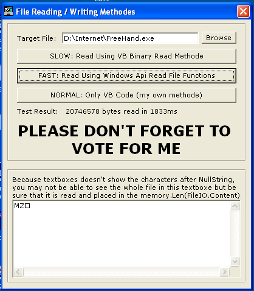

<div align="center">

## HYPER FAST READ FILE \#2


</div>

### Description

This File reading tests compare 3 methodes of reading file. One is using Api, second is using random access file methode and third is using binary file methode. I have tested all and found that using Api is the best and fastest solution for reading files. I have included 3 classes for these 3 methodes and a template project to test them. In my tests, i have used a PIII450mhz, 195MBRam with WinXP Pro. I have read a 20mb file in 1.8seconds.
 
### More Info
 
Warning,

These classes read the file to a string so it takes the whole file in memory. If you don't have enough space, it may force Windows to create more temp. memory in your HDD. and it may slow down the process..


<span>             |<span>
---                |---
**Submitted On**   |2002-07-07 20:01:18
**By**             |[tektus](https://github.com/Planet-Source-Code/PSCIndex/blob/master/ByAuthor/tektus.md)
**Level**          |Advanced
**User Rating**    |4.7 (56 globes from 12 users)
**Compatibility**  |VB 3\.0, VB 4\.0 \(16\-bit\), VB 4\.0 \(32\-bit\), VB 5\.0, VB 6\.0
**Category**       |[Files/ File Controls/ Input/ Output](https://github.com/Planet-Source-Code/PSCIndex/blob/master/ByCategory/files-file-controls-input-output__1-3.md)
**World**          |[Visual Basic](https://github.com/Planet-Source-Code/PSCIndex/blob/master/ByWorld/visual-basic.md)
**Archive File**   |[HYPER\_FAST1113417272002\.zip](https://github.com/Planet-Source-Code/tektus-hyper-fast-read-file-2__1-37302/archive/master.zip)

### API Declarations

```
Private Declare Function GetTickCount& Lib "kernel32" ()
Const FILE_BEGIN = 0
Const FILE_SHARE_READ = &H1
Const FILE_SHARE_WRITE = &H2
Const OPEN_EXISTING = 3
Const GENERIC_READ = &H80000000
Private Declare Function ReadFile Lib "kernel32" (ByVal hFile As Long, lpBuffer As Any, ByVal nNumberOfBytesToRead As Long, lpNumberOfBytesRead As Long, ByVal lpOverlapped As Any) As Long
Private Declare Function CreateFile Lib "kernel32" Alias "CreateFileA" (ByVal lpFileName As String, ByVal dwDesiredAccess As Long, ByVal dwShareMode As Long, ByVal lpSecurityAttributes As Any, ByVal dwCreationDisposition As Long, ByVal dwFlagsAndAttributes As Long, ByVal hTemplateFile As Long) As Long
Private Declare Function CloseHandle Lib "kernel32" (ByVal hObject As Long) As Long
Private Declare Function SetFilePointer Lib "kernel32" (ByVal hFile As Long, ByVal lDistanceToMove As Long, lpDistanceToMoveHigh As Long, ByVal dwMoveMethod As Long) As Long
Private Declare Function GetFileSize Lib "kernel32" (ByVal hFile As Long, lpFileSizeHigh As Long) As Long
```


